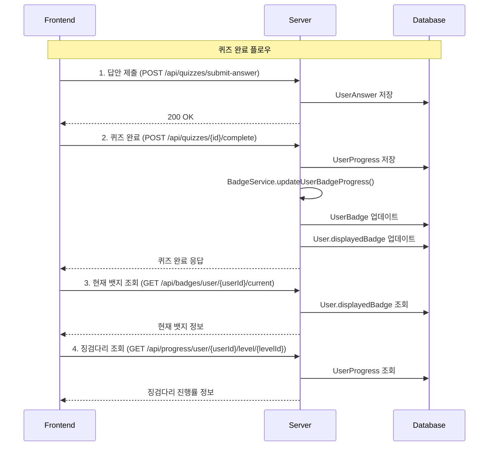

# 🎯 프론트엔드 개발자를 위한 퀴즈 시스템 가이드

> **Finsight 금융 교육 플랫폼** - 퀴즈 완료, 뱃지 시스템, 징검다리 진행률 구현 가이드

---

## 📋 목차

1. [전체 플로우 다이어그램](#1-전체-플로우-다이어그램)
2. [API 엔드포인트 목록](#2-api-엔드포인트-목록)
3. [단계별 구현 가이드](#3-단계별-구현-가이드)
4. [완전한 퀴즈 플로우 예시](#4-완전한-퀴즈-플로우-예시)
5. [UI 업데이트 함수](#5-ui-업데이트-함수)
6. [API 응답 예시](#6-api-응답-예시)
7. [에러 처리](#7-에러-처리)
8. [핵심 포인트](#8-핵심-포인트)

---

## 1. 전체 플로우 다이어그램



---

## 2. API 엔드포인트 목록

### 🎯 퀴즈 관련 API
| 메서드 | 엔드포인트 | 설명 |
|--------|------------|------|
| `POST` | `/api/quizzes/submit-answer` | 답안 제출 |
| `POST` | `/api/quizzes/{id}/complete` | 퀴즈 완료 |
| `GET` | `/api/quizzes/{id}` | 퀴즈 정보 조회 |

### 🏅 뱃지 관련 API
| 메서드 | 엔드포인트 | 설명 |
|--------|------------|------|
| `GET` | `/api/badges/user/{userId}/current` | 현재 뱃지 조회 |
| `GET` | `/api/badges/user/{userId}/summary` | 뱃지 요약 조회 |
| `GET` | `/api/badges/user/{userId}/all` | 모든 뱃지 조회 |

### 📊 진행률 관련 API
| 메서드 | 엔드포인트 | 설명 |
|--------|------------|------|
| `GET` | `/api/progress/user/{userId}/level/{levelId}` | 레벨별 징검다리 조회 |
| `GET` | `/api/progress/user/{userId}/summary` | 진행률 요약 조회 |
| `GET` | `/api/progress/user/{userId}` | 전체 진행률 조회 |

---

## 3. 단계별 구현 가이드

### Step 1: 답안 제출
```javascript
// 각 문제별 답안 제출
async function submitAnswer(userId, questionId, selectedOptionId) {
  const response = await fetch('/api/quizzes/submit-answer', {
    method: 'POST',
    headers: {
      'Content-Type': 'application/json',
    },
    body: JSON.stringify({
      userId: userId,
      questionId: questionId,
      selectedOptionId: selectedOptionId
    })
  });
  
  if (!response.ok) {
    throw new Error('답안 제출 실패');
  }
  
  return response.json();
}
```

### Step 2: 퀴즈 완료
```javascript
// 모든 답안 제출 후 퀴즈 완료
async function completeQuiz(userId, quizId) {
  const response = await fetch(`/api/quizzes/${quizId}/complete?userId=${userId}`, {
    method: 'POST',
    headers: {
      'Content-Type': 'application/json',
    }
  });
  
  if (!response.ok) {
    throw new Error('퀴즈 완료 실패');
  }
  
  const result = await response.json();
  console.log('퀴즈 완료:', result);
  
  // 퀴즈 완료 후 뱃지와 징검다리가 자동으로 업데이트됨!
  return result;
}
```

### Step 3: 현재 뱃지 조회
```javascript
// 현재 사용자의 뱃지 정보 조회
async function getCurrentBadge(userId) {
  const response = await fetch(`/api/badges/user/${userId}/current`, {
    method: 'GET',
    headers: {
      'Content-Type': 'application/json',
    }
  });
  
  if (!response.ok) {
    throw new Error('뱃지 조회 실패');
  }
  
  const badge = await response.json();
  console.log('현재 뱃지:', badge);
  
  return badge;
}
```

### Step 4: 징검다리 진행률 조회
```javascript
// 레벨별 징검다리 진행률 조회
async function getLevelProgress(userId, levelId) {
  const response = await fetch(`/api/progress/user/${userId}/level/${levelId}`, {
    method: 'GET',
    headers: {
      'Content-Type': 'application/json',
    }
  });
  
  if (!response.ok) {
    throw new Error('진행률 조회 실패');
  }
  
  const progress = await response.json();
  console.log('징검다리 진행률:', progress);
  
  return progress;
}

// 사용자 전체 진행률 요약 조회
async function getUserProgressSummary(userId) {
  const response = await fetch(`/api/progress/user/${userId}/summary`, {
    method: 'GET',
    headers: {
      'Content-Type': 'application/json',
    }
  });
  
  if (!response.ok) {
    throw new Error('진행률 요약 조회 실패');
  }
  
  const summary = await response.json();
  console.log('진행률 요약:', summary);
  
  return summary;
}
```

---

## 4. 완전한 퀴즈 플로우 예시

```javascript
// 퀴즈 완료 전체 플로우 (징검다리 포함)
async function completeQuizFlow(userId, quizId, levelId, answers) {
  try {
    // 1. 모든 답안 제출
    for (const answer of answers) {
      await submitAnswer(userId, answer.questionId, answer.selectedOptionId);
    }
    
    // 2. 퀴즈 완료 (이때 뱃지와 징검다리 자동 업데이트)
    const quizResult = await completeQuiz(userId, quizId);
    
    // 3. 업데이트된 뱃지 조회
    const currentBadge = await getCurrentBadge(userId);
    
    // 4. 징검다리 진행률 조회
    const levelProgress = await getLevelProgress(userId, levelId);
    
    // 5. UI 업데이트
    updateBadgeDisplay(currentBadge);
    updateSteppingStones(levelProgress);
    showQuizResult(quizResult);
    
    return {
      quizResult,
      currentBadge,
      levelProgress
    };
    
  } catch (error) {
    console.error('퀴즈 완료 중 오류:', error);
    throw error;
  }
}
```

---

## 5. UI 업데이트 함수

### JavaScript UI 업데이트 함수
```javascript
// 징검다리 UI 업데이트
function updateSteppingStones(progress) {
  const steppingStonesContainer = document.getElementById('stepping-stones');
  
  if (!progress.steps || progress.steps.length === 0) {
    steppingStonesContainer.innerHTML = '<p>진행률 정보가 없습니다.</p>';
    return;
  }
  
  const stepsHtml = progress.steps.map(step => {
    const stepClass = getStepClass(step);
    const progressPercent = (step.completedQuizzes / step.totalQuizzes) * 100;
    
    return `
      <div class="stepping-stone ${stepClass}" data-step="${step.stepNumber}">
        <div class="stone-icon">
          ${getStepIcon(step)}
        </div>
        <div class="stone-info">
          <h4>${step.stepTitle}</h4>
          <p>${step.completedQuizzes}/${step.totalQuizzes} 완료</p>
          <div class="progress-bar">
            <div class="progress-fill" style="width: ${progressPercent}%"></div>
          </div>
          <p class="pass-rate">통과율: ${(step.passRate * 100).toFixed(1)}%</p>
        </div>
      </div>
    `;
  }).join('');
  
  steppingStonesContainer.innerHTML = stepsHtml;
}

// 징검다리 단계별 상태 클래스 결정
function getStepClass(step) {
  if (step.isCompleted && step.isPassed) {
    return 'completed-passed'; // 완료 + 통과
  } else if (step.isCompleted && !step.isPassed) {
    return 'completed-failed'; // 완료 + 실패
  } else if (step.completedQuizzes > 0) {
    return 'in-progress'; // 진행 중
  } else {
    return 'not-started'; // 미시작
  }
}

// 징검다리 아이콘 결정
function getStepIcon(step) {
  if (step.isCompleted && step.isPassed) {
    return '✅'; // 완료 + 통과
  } else if (step.isCompleted && !step.isPassed) {
    return '❌'; // 완료 + 실패
  } else if (step.completedQuizzes > 0) {
    return '🔄'; // 진행 중
  } else {
    return '⭕'; // 미시작
  }
}

// 뱃지 UI 업데이트
function updateBadgeDisplay(badge) {
  const badgeElement = document.getElementById('user-badge');
  badgeElement.innerHTML = `
    
    <span>${badge.name}</span>
    <span>Level ${badge.levelNumber}</span>
  `;
}

// 퀴즈 결과 표시
function showQuizResult(result) {
  const resultElement = document.getElementById('quiz-result');
  resultElement.innerHTML = `
    <h3>${result.passed ? '축하합니다!' : '아쉽습니다!'}</h3>
    <p>${result.message}</p>
    <p>점수: ${result.score}/${result.totalQuestions}</p>
  `;
}
```


---

## 6. API 응답 예시

### 퀴즈 완료 응답
```json
{
  "quizId": 1,
  "userId": 908,
  "totalQuestions": 4,
  "correctAnswers": 4,
  "passed": true,
  "score": 4,
  "message": "축하합니다! 4문제 중 4문제를 맞혔습니다."
}
```

### 현재 뱃지 응답
```json
{
  "id": 2,
  "name": "실버",
  "iconUrl": "https://example.com/silver.png",
  "levelNumber": 2,
  "description": "중급자 뱃지",
  "isAchieved": true,
  "progress": 100
}
```

### 징검다리 진행률 응답
```json
{
  "levelId": 1,
  "levelNumber": 1,
  "levelTitle": "기초 금융 상식",
  "totalQuizzes": 4,
  "completedQuizzes": 4,
  "passedQuizzes": 4,
  "completionRate": 1.0,
  "passRate": 1.0,
  "steps": [
    {
      "stepNumber": 1,
      "stepTitle": "1단계",
      "completedQuizzes": 4,
      "totalQuizzes": 4,
      "passedQuizzes": 4,
      "failedQuizzes": 0,
      "isCompleted": true,
      "isPassed": true,
      "passRate": 1.0,
      "stepDescription": "기초 금융 상식"
    }
  ],
  "isStepPassed": true,
  "currentStep": 1
}
```

---

## 7. 에러 처리

```javascript
// 에러 처리 예시
async function handleQuizError(error) {
  if (error.message.includes('No answers found')) {
    alert('먼저 모든 문제에 답안을 제출해주세요.');
  } else if (error.message.includes('User not found')) {
    alert('사용자 정보를 찾을 수 없습니다.');
  } else if (error.message.includes('진행률 조회 실패')) {
    alert('진행률 정보를 불러올 수 없습니다.');
  } else if (error.message.includes('뱃지 조회 실패')) {
    alert('뱃지 정보를 불러올 수 없습니다.');
  } else {
    alert('오류가 발생했습니다. 다시 시도해주세요.');
  }
}

// try-catch를 사용한 안전한 API 호출
async function safeApiCall(apiFunction, ...args) {
  try {
    return await apiFunction(...args);
  } catch (error) {
    handleQuizError(error);
    throw error;
  }
}
```

---

## 8. 핵심 포인트

### ✅ 자동화된 시스템
- **퀴즈 완료 시 자동 업데이트**: 뱃지와 징검다리가 자동으로 업데이트됨
- **실시간 반영**: `displayedBadge`와 `steps` 정보가 실시간으로 반영
- **순서 중요**: 답안 제출 → 퀴즈 완료 → 뱃지 조회 → 징검다리 조회

### 🎯 징검다리 시스템
- **통과 조건**: 4문제 중 2문제 이상 맞춰야 통과 (50% 이상)
- **완성 조건**: 4문제 모두 완료해야 징검다리 완성
- **상태별 표시**:
  - ✅ **완료 + 통과**: 체크마크
  - ❌ **완료 + 실패**: X마크  
  - 🔄 **진행 중**: 진행 아이콘
  - ⭕ **미시작**: 빈 원

### 🔧 개발 팁
- **에러 처리**: 각 단계별 에러 처리 필수
- **로딩 상태**: API 호출 중 로딩 표시 권장
- **사용자 피드백**: 뱃지 업그레이드 시 축하 메시지 표시

---

## 🚀 시작하기

1. **API 테스트**: Postman이나 curl로 각 API 엔드포인트 테스트
2. **기본 플로우 구현**: 답안 제출 → 퀴즈 완료 → 뱃지 조회
3. **징검다리 UI 추가**: 진행률을 시각적으로 표시
4. **에러 처리 강화**: 사용자 친화적인 에러 메시지
5. **사용자 경험 개선**: 애니메이션, 로딩 상태 등 추가

---

**이제 프론트엔드에서 완벽한 퀴즈 시스템을 구현할 수 있습니다!** 🎉

문의사항이 있으시면 백엔드 개발팀에 연락해주세요.
