# 🎯 프론트엔드 개발자를 위한 퀴즈 시스템 가이드

> **Finsight 금융 교육 플랫폼** - 퀴즈 완료, 뱃지 시스템, 징검다리 진행률 구현 가이드

---

## 📋 목차

1. [전체 플로우 다이어그램](#1-전체-플로우-다이어그램)
2. [API 엔드포인트 목록](#2-api-엔드포인트-목록)
3. [단계별 구현 가이드](#3-단계별-구현-가이드)
4. [완전한 퀴즈 플로우 예시](#4-완전한-퀴즈-플로우-예시)
5. [UI 업데이트 함수](#5-ui-업데이트-함수)
6. [API 응답 예시](#6-api-응답-예시)
7. [에러 처리](#7-에러-처리)
8. [핵심 포인트](#8-핵심-포인트)

---

## 1. 전체 플로우 다이어그램

```mermaid
sequenceDiagram
    participant F as Frontend
    participant S as Server
    participant DB as Database

    Note over F,DB: 퀴즈 완료 플로우

    F->>S: 1. 답안 제출 (POST /api/quizzes/submit-answer)
    S->>DB: UserAnswer 저장
    S-->>F: 200 OK

    F->>S: 2. 퀴즈 완료 (POST /api/quizzes/{id}/complete)
    S->>DB: UserProgress 저장
    S->>S: BadgeService.updateUserBadgeProgress()
    S->>DB: UserBadge 업데이트
    S->>DB: User.displayedBadge 업데이트
    S-->>F: 퀴즈 완료 응답

    F->>S: 3. 현재 뱃지 조회 (GET /api/badges/user/{userId}/current)
    S->>DB: User.displayedBadge 조회
    S-->>F: 현재 뱃지 정보

    F->>S: 4. 징검다리 조회 (GET /api/progress/user/{userId}/level/{levelId})
    S->>DB: UserProgress 조회
    S-->>F: 징검다리 진행률 정보
```



---

## 2. API 엔드포인트 목록

### 🎯 퀴즈 관련 API
| 메서드 | 엔드포인트 | 설명 |
|--------|------------|------|
| `POST` | `/api/quizzes/submit-answer` | 답안 제출 |
| `POST` | `/api/quizzes/{id}/complete` | 퀴즈 완료 |
| `POST` | `/api/quizzes/{id}/retry` | 퀴즈 다시풀기 (이전 답변 삭제) |
| `GET` | `/api/quizzes/{id}` | 퀴즈 정보 조회 |
| `GET` | `/api/quizzes/user/{userId}/total-score` | 사용자 총점수 조회 |

### 🏅 뱃지 관련 API
| 메서드 | 엔드포인트 | 설명 |
|--------|------------|------|
| `GET` | `/api/badges/user/{userId}/current` | 현재 뱃지 조회 |
| `GET` | `/api/badges/user/{userId}/summary` | 뱃지 요약 조회 |
| `GET` | `/api/badges/user/{userId}/all` | 모든 뱃지 조회 |

### 📊 진행률 관련 API
| 메서드 | 엔드포인트 | 설명 |
|--------|------------|------|
| `GET` | `/api/progress/user/{userId}/level/{levelId}` | 레벨별 징검다리 조회 |
| `GET` | `/api/progress/user/{userId}/summary` | 진행률 요약 조회 |
| `GET` | `/api/progress/user/{userId}` | 전체 진행률 조회 |

### 📝 오답노트 관련 API
| 메서드 | 엔드포인트 | 설명 |
|--------|------------|------|
| `GET` | `/api/wrong-notes` | 오답노트 목록 조회 (필터링, 페이징) |
| `GET` | `/api/wrong-notes/{noteId}` | 특정 오답노트 상세 조회 |
| `PUT` | `/api/wrong-notes/{noteId}/personal-note` | 개인 메모 업데이트 |
| `PUT` | `/api/wrong-notes/{noteId}/toggle-resolved` | 해결 상태 토글 |
| `PUT` | `/api/wrong-notes/{noteId}/mark-reviewed` | 복습 완료 처리 |
| `DELETE` | `/api/wrong-notes/{noteId}` | 오답노트 삭제 |
| `GET` | `/api/wrong-notes/statistics` | 오답노트 통계 조회 |

### 💬 커뮤니티 관련 API
| 메서드 | 엔드포인트 | 설명 |
|--------|------------|------|
| `POST` | `/api/community/posts` | 포스트 작성 |
| `GET` | `/api/community/posts` | 포스트 목록 조회 |
| `GET` | `/api/community/posts/{postId}` | 특정 포스트 조회 |
| `PUT` | `/api/community/posts/{postId}` | 포스트 수정 |
| `DELETE` | `/api/community/posts/{postId}` | 포스트 삭제 |
| `POST` | `/api/community/posts/{postId}/like` | 좋아요 토글 |
| `GET` | `/api/community/posts/{postId}/like` | 좋아요 상태 확인 |
| `POST` | `/api/community/posts/{postId}/comments` | 댓글 작성 |
| `GET` | `/api/community/posts/{postId}/comments` | 댓글 목록 조회 |
| `PUT` | `/api/community/posts/comments/{commentId}` | 댓글 수정 |
| `DELETE` | `/api/community/posts/comments/{commentId}` | 댓글 삭제 |
| `GET` | `/api/community/posts/comments/user/{userId}` | 사용자 댓글 목록 조회 |

---

## 3. 단계별 구현 가이드

### Step 1: 답안 제출
```javascript
// 각 문제별 답안 제출
async function submitAnswer(userId, questionId, selectedOptionId) {
  const response = await fetch('/api/quizzes/submit-answer', {
    method: 'POST',
    headers: {
      'Content-Type': 'application/json',
    },
    body: JSON.stringify({
      userId: userId,
      questionId: questionId,
      selectedOptionId: selectedOptionId
    })
  });
  
  if (!response.ok) {
    throw new Error('답안 제출 실패');
  }
  
  return response.json();
}
```

### Step 2: 퀴즈 완료
```javascript
// 모든 답안 제출 후 퀴즈 완료
async function completeQuiz(userId, quizId) {
  const response = await fetch(`/api/quizzes/${quizId}/complete?userId=${userId}`, {
    method: 'POST',
    headers: {
      'Content-Type': 'application/json',
    }
  });
  
  if (!response.ok) {
    throw new Error('퀴즈 완료 실패');
  }
  
  const result = await response.json();
  console.log('퀴즈 완료:', result);
  
  // 퀴즈 완료 후 뱃지와 징검다리가 자동으로 업데이트됨!
  return result;
}
```

### Step 2-1: 퀴즈 다시풀기 (실패 시)
```javascript
// 퀴즈 실패 시 다시풀기 (이전 답변 삭제 후 새로 시작)
async function retryQuiz(userId, quizId) {
  const response = await fetch(`/api/quizzes/${quizId}/retry?userId=${userId}`, {
    method: 'POST',
    headers: {
      'Content-Type': 'application/json',
    }
  });
  
  if (!response.ok) {
    throw new Error('퀴즈 다시풀기 실패');
  }
  
  const result = await response.text();
  console.log('퀴즈 다시풀기 준비 완료:', result);
  
  // 이제 새로 퀴즈를 시작할 수 있습니다!
  return result;
}
```

### Step 3: 현재 뱃지 조회
```javascript
// 현재 사용자의 뱃지 정보 조회
async function getCurrentBadge(userId) {
  const response = await fetch(`/api/badges/user/${userId}/current`, {
    method: 'GET',
    headers: {
      'Content-Type': 'application/json',
    }
  });
  
  if (!response.ok) {
    throw new Error('뱃지 조회 실패');
  }
  
  const badge = await response.json();
  console.log('현재 뱃지:', badge);
  
  return badge;
}
```

### Step 4: 징검다리 진행률 조회
```javascript
// 레벨별 징검다리 진행률 조회
async function getLevelProgress(userId, levelId) {
  const response = await fetch(`/api/progress/user/${userId}/level/${levelId}`, {
    method: 'GET',
    headers: {
      'Content-Type': 'application/json',
    }
  });
  
  if (!response.ok) {
    throw new Error('진행률 조회 실패');
  }
  
  const progress = await response.json();
  console.log('징검다리 진행률:', progress);
  
  return progress;
}

// 사용자 전체 진행률 요약 조회
async function getUserProgressSummary(userId) {
  const response = await fetch(`/api/progress/user/${userId}/summary`, {
    method: 'GET',
    headers: {
      'Content-Type': 'application/json',
    }
  });
  
  if (!response.ok) {
    throw new Error('진행률 요약 조회 실패');
  }
  
  const summary = await response.json();
  console.log('진행률 요약:', summary);
  
  return summary;
}
```

### Step 5: 사용자 총점수 조회
```javascript
// 사용자 총점수 조회
async function getUserTotalScore(userId) {
  const response = await fetch(`/api/quizzes/user/${userId}/total-score`, {
    method: 'GET',
    headers: {
      'Content-Type': 'application/json',
    }
  });
  
  if (!response.ok) {
    throw new Error('총점수 조회 실패');
  }
  
  const scoreData = await response.json();
  console.log('사용자 총점수:', scoreData);
  
  return scoreData;
}

// 총점수 표시 함수
function displayUserScore(scoreData) {
  const { totalScore, completedQuizzes, passedQuizzes, averageScore, passRate } = scoreData;
  
  document.getElementById('total-score').textContent = totalScore;
  document.getElementById('completed-quizzes').textContent = completedQuizzes;
  document.getElementById('passed-quizzes').textContent = passedQuizzes;
  document.getElementById('average-score').textContent = averageScore.toFixed(1);
  document.getElementById('pass-rate').textContent = (passRate * 100).toFixed(1) + '%';
}
```

### Step 6: 오답노트 조회 및 관리
```javascript
// 오답노트 목록 조회 (필터링, 페이징)
async function getWrongNotes(userId, page = 0, size = 20, filter = 'all') {
  const response = await fetch(`/api/wrong-notes?userId=${userId}&page=${page}&size=${size}&filter=${filter}`, {
    method: 'GET',
    headers: {
      'Content-Type': 'application/json',
    }
  });
  
  if (!response.ok) {
    throw new Error('오답노트 조회 실패');
  }
  
  const wrongNotes = await response.json();
  console.log('오답노트 목록:', wrongNotes);
  
  return wrongNotes;
}

// 특정 오답노트 상세 조회
async function getWrongNote(userId, noteId) {
  const response = await fetch(`/api/wrong-notes/${noteId}?userId=${userId}`, {
    method: 'GET',
    headers: {
      'Content-Type': 'application/json',
    }
  });
  
  if (!response.ok) {
    throw new Error('오답노트 상세 조회 실패');
  }
  
  const wrongNote = await response.json();
  console.log('오답노트 상세:', wrongNote);
  
  return wrongNote;
}

// 개인 메모 업데이트
async function updatePersonalNote(userId, noteId, personalNoteMd) {
  const response = await fetch(`/api/wrong-notes/${noteId}/personal-note?userId=${userId}`, {
    method: 'PUT',
    headers: {
      'Content-Type': 'application/json',
    },
    body: personalNoteMd
  });
  
  if (!response.ok) {
    throw new Error('개인 메모 업데이트 실패');
  }
  
  const updatedNote = await response.json();
  console.log('개인 메모 업데이트 완료:', updatedNote);
  
  return updatedNote;
}

// 해결 상태 토글
async function toggleResolved(userId, noteId) {
  const response = await fetch(`/api/wrong-notes/${noteId}/toggle-resolved?userId=${userId}`, {
    method: 'PUT',
    headers: {
      'Content-Type': 'application/json',
    }
  });
  
  if (!response.ok) {
    throw new Error('해결 상태 변경 실패');
  }
  
  const updatedNote = await response.json();
  console.log('해결 상태 변경 완료:', updatedNote);
  
  return updatedNote;
}

// 복습 완료 처리
async function markAsReviewed(userId, noteId) {
  const response = await fetch(`/api/wrong-notes/${noteId}/mark-reviewed?userId=${userId}`, {
    method: 'PUT',
    headers: {
      'Content-Type': 'application/json',
    }
  });
  
  if (!response.ok) {
    throw new Error('복습 완료 처리 실패');
  }
  
  const updatedNote = await response.json();
  console.log('복습 완료 처리 완료:', updatedNote);
  
  return updatedNote;
}

// 오답노트 통계 조회
async function getWrongNoteStatistics(userId) {
  const response = await fetch(`/api/wrong-notes/statistics?userId=${userId}`, {
    method: 'GET',
    headers: {
      'Content-Type': 'application/json',
    }
  });
  
  if (!response.ok) {
    throw new Error('오답노트 통계 조회 실패');
  }
  
  const statistics = await response.json();
  console.log('오답노트 통계:', statistics);
  
  return statistics;
}
```

### Step 7: 커뮤니티 포스트 관리
```javascript
// 포스트 작성
async function createPost(userId, title, content) {
  const response = await fetch('/api/community/posts', {
    method: 'POST',
    headers: {
      'Content-Type': 'application/json',
    },
    body: JSON.stringify({
      title: title,
      content: content
    })
  });
  
  if (!response.ok) {
    throw new Error('포스트 작성 실패');
  }
  
  const post = await response.json();
  console.log('포스트 작성 완료:', post);
  
  return post;
}

// 포스트 목록 조회
async function getAllPosts() {
  const response = await fetch('/api/community/posts', {
    method: 'GET',
    headers: {
      'Content-Type': 'application/json',
    }
  });
  
  if (!response.ok) {
    throw new Error('포스트 목록 조회 실패');
  }
  
  const posts = await response.json();
  console.log('포스트 목록:', posts);
  
  return posts;
}

// 특정 포스트 조회
async function getPost(postId) {
  const response = await fetch(`/api/community/posts/${postId}`, {
    method: 'GET',
    headers: {
      'Content-Type': 'application/json',
    }
  });
  
  if (!response.ok) {
    throw new Error('포스트 조회 실패');
  }
  
  const post = await response.json();
  console.log('포스트 상세:', post);
  
  return post;
}

// 포스트 수정
async function updatePost(userId, postId, title, content) {
  const response = await fetch(`/api/community/posts/${postId}`, {
    method: 'PUT',
    headers: {
      'Content-Type': 'application/json',
    },
    body: JSON.stringify({
      title: title,
      content: content
    })
  });
  
  if (!response.ok) {
    throw new Error('포스트 수정 실패');
  }
  
  const updatedPost = await response.json();
  console.log('포스트 수정 완료:', updatedPost);
  
  return updatedPost;
}

// 포스트 삭제
async function deletePost(userId, postId) {
  const response = await fetch(`/api/community/posts/${postId}`, {
    method: 'DELETE',
    headers: {
      'Content-Type': 'application/json',
    }
  });
  
  if (!response.ok) {
    throw new Error('포스트 삭제 실패');
  }
  
  const result = await response.text();
  console.log('포스트 삭제 완료:', result);
  
  return result;
}
```

### Step 8: 커뮤니티 좋아요 및 댓글 관리
```javascript
// 좋아요 토글
async function togglePostLike(userId, postId) {
  const response = await fetch(`/api/community/posts/${postId}/like?userId=${userId}`, {
    method: 'POST',
    headers: {
      'Content-Type': 'application/json',
    }
  });
  
  if (!response.ok) {
    throw new Error('좋아요 처리 실패');
  }
  
  const likeResult = await response.json();
  console.log('좋아요 상태:', likeResult);
  
  return likeResult;
}

// 좋아요 상태 확인
async function getPostLikeStatus(userId, postId) {
  const response = await fetch(`/api/community/posts/${postId}/like?userId=${userId}`, {
    method: 'GET',
    headers: {
      'Content-Type': 'application/json',
    }
  });
  
  if (!response.ok) {
    throw new Error('좋아요 상태 조회 실패');
  }
  
  const likeStatus = await response.json();
  console.log('좋아요 상태:', likeStatus);
  
  return likeStatus;
}

// 댓글 작성
async function createComment(userId, postId, content) {
  const response = await fetch(`/api/community/posts/${postId}/comments?userId=${userId}`, {
    method: 'POST',
    headers: {
      'Content-Type': 'application/json',
    },
    body: JSON.stringify({
      content: content
    })
  });
  
  if (!response.ok) {
    throw new Error('댓글 작성 실패');
  }
  
  const comment = await response.json();
  console.log('댓글 작성 완료:', comment);
  
  return comment;
}

// 댓글 목록 조회
async function getPostComments(postId, page = 0, size = 20) {
  const response = await fetch(`/api/community/posts/${postId}/comments?page=${page}&size=${size}`, {
    method: 'GET',
    headers: {
      'Content-Type': 'application/json',
    }
  });
  
  if (!response.ok) {
    throw new Error('댓글 목록 조회 실패');
  }
  
  const comments = await response.json();
  console.log('댓글 목록:', comments);
  
  return comments;
}

// 댓글 수정
async function updateComment(userId, commentId, content) {
  const response = await fetch(`/api/community/posts/comments/${commentId}?userId=${userId}`, {
    method: 'PUT',
    headers: {
      'Content-Type': 'application/json',
    },
    body: JSON.stringify({
      content: content
    })
  });
  
  if (!response.ok) {
    throw new Error('댓글 수정 실패');
  }
  
  const updatedComment = await response.json();
  console.log('댓글 수정 완료:', updatedComment);
  
  return updatedComment;
}

// 댓글 삭제
async function deleteComment(userId, commentId) {
  const response = await fetch(`/api/community/posts/comments/${commentId}?userId=${userId}`, {
    method: 'DELETE',
    headers: {
      'Content-Type': 'application/json',
    }
  });
  
  if (!response.ok) {
    throw new Error('댓글 삭제 실패');
  }
  
  const result = await response.text();
  console.log('댓글 삭제 완료:', result);
  
  return result;
}

// 사용자 댓글 목록 조회
async function getUserComments(userId, page = 0, size = 20) {
  const response = await fetch(`/api/community/posts/comments/user/${userId}?page=${page}&size=${size}`, {
    method: 'GET',
    headers: {
      'Content-Type': 'application/json',
    }
  });
  
  if (!response.ok) {
    throw new Error('사용자 댓글 목록 조회 실패');
  }
  
  const userComments = await response.json();
  console.log('사용자 댓글 목록:', userComments);
  
  return userComments;
}
```

---

## 4. 완전한 퀴즈 플로우 예시

```javascript
// 퀴즈 완료 전체 플로우 (징검다리 포함)
async function completeQuizFlow(userId, quizId, levelId, answers) {
  try {
    // 1. 모든 답안 제출 (틀린 문제는 자동으로 오답노트에 저장됨)
    for (const answer of answers) {
      await submitAnswer(userId, answer.questionId, answer.selectedOptionId);
    }
    
    // 2. 퀴즈 완료 (이때 뱃지와 징검다리 자동 업데이트)
    const quizResult = await completeQuiz(userId, quizId);
    
    // 3. 사용자 총점수 조회
    const userScore = await getUserTotalScore(userId);
    
    // 4. 퀴즈 결과에 따른 처리
    if (quizResult.passed) {
      // 4-1. 통과한 경우: 뱃지와 징검다리 조회
      const currentBadge = await getCurrentBadge(userId);
      const levelProgress = await getLevelProgress(userId, levelId);
      
      // UI 업데이트
      updateBadgeDisplay(currentBadge);
      updateSteppingStones(levelProgress);
      displayUserScore(userScore);
      showQuizResult(quizResult);
      
      return {
        quizResult,
        currentBadge,
        levelProgress,
        userScore
      };
    } else {
      // 4-2. 실패한 경우: 다시풀기 옵션 제공
      displayUserScore(userScore);
      showQuizResult(quizResult);
      showRetryOption(userId, quizId);
      
      return {
        quizResult,
        userScore,
        needsRetry: true
      };
    }
    
  } catch (error) {
    console.error('퀴즈 완료 중 오류:', error);
    throw error;
  }
}

// 오답노트 복습 플로우
async function reviewWrongNotesFlow(userId) {
  try {
    // 1. 오답노트 목록 조회 (미해결 문제만)
    const wrongNotes = await getWrongNotes(userId, 0, 20, 'unresolved');
    
    // 2. 오답노트 통계 조회
    const statistics = await getWrongNoteStatistics(userId);
    
    // 3. UI 업데이트
    displayWrongNotes(wrongNotes.wrongNotes);
    displayWrongNoteStatistics(statistics);
    
    return {
      wrongNotes: wrongNotes.wrongNotes,
      statistics
    };
    
  } catch (error) {
    console.error('오답노트 복습 중 오류:', error);
    throw error;
  }
}

// 다시풀기 플로우
async function retryQuizFlow(userId, quizId) {
  try {
    // 1. 다시풀기 (이전 답변 삭제)
    await retryQuiz(userId, quizId);
    
    // 2. 퀴즈 정보 다시 조회 (새로 시작)
    const quizInfo = await fetch(`/api/quizzes/${quizId}`).then(res => res.json());
    
    // 3. UI 초기화
    resetQuizUI();
    showQuizQuestions(quizInfo);
    
    return quizInfo;
    
  } catch (error) {
    console.error('다시풀기 중 오류:', error);
    throw error;
  }
}
```

---

## 5. UI 업데이트 함수

### JavaScript UI 업데이트 함수
```javascript
// 징검다리 UI 업데이트
function updateSteppingStones(progress) {
  const steppingStonesContainer = document.getElementById('stepping-stones');
  
  if (!progress.steps || progress.steps.length === 0) {
    steppingStonesContainer.innerHTML = '<p>진행률 정보가 없습니다.</p>';
    return;
  }
  
  const stepsHtml = progress.steps.map(step => {
    const stepClass = getStepClass(step);
    const progressPercent = (step.completedQuizzes / step.totalQuizzes) * 100;
    
    return `
      <div class="stepping-stone ${stepClass}" data-step="${step.stepNumber}">
        <div class="stone-icon">
          ${getStepIcon(step)}
        </div>
        <div class="stone-info">
          <h4>${step.stepTitle}</h4>
          <p>${step.completedQuizzes}/${step.totalQuizzes} 완료</p>
          <div class="progress-bar">
            <div class="progress-fill" style="width: ${progressPercent}%"></div>
          </div>
          <p class="pass-rate">통과율: ${(step.passRate * 100).toFixed(1)}%</p>
        </div>
      </div>
    `;
  }).join('');
  
  steppingStonesContainer.innerHTML = stepsHtml;
}

// 징검다리 단계별 상태 클래스 결정
function getStepClass(step) {
  if (step.isCompleted && step.isPassed) {
    return 'completed-passed'; // 완료 + 통과
  } else if (step.isCompleted && !step.isPassed) {
    return 'completed-failed'; // 완료 + 실패
  } else if (step.completedQuizzes > 0) {
    return 'in-progress'; // 진행 중
  } else {
    return 'not-started'; // 미시작
  }
}

// 사용자 총점수 표시 함수
function displayUserScore(scoreData) {
  const { totalScore, completedQuizzes, passedQuizzes, averageScore, passRate } = scoreData;
  
  // 총점수 표시
  const totalScoreElement = document.getElementById('total-score');
  if (totalScoreElement) {
    totalScoreElement.textContent = totalScore;
  }
  
  // 완료 퀴즈 수 표시
  const completedQuizzesElement = document.getElementById('completed-quizzes');
  if (completedQuizzesElement) {
    completedQuizzesElement.textContent = completedQuizzes;
  }
  
  // 통과 퀴즈 수 표시
  const passedQuizzesElement = document.getElementById('passed-quizzes');
  if (passedQuizzesElement) {
    passedQuizzesElement.textContent = passedQuizzes;
  }
  
  // 평균 점수 표시
  const averageScoreElement = document.getElementById('average-score');
  if (averageScoreElement) {
    averageScoreElement.textContent = averageScore.toFixed(1);
  }
  
  // 통과율 표시
  const passRateElement = document.getElementById('pass-rate');
  if (passRateElement) {
    passRateElement.textContent = (passRate * 100).toFixed(1) + '%';
  }
  
  // 점수 등급 표시
  const scoreGradeElement = document.getElementById('score-grade');
  if (scoreGradeElement) {
    const grade = getScoreGrade(averageScore);
    scoreGradeElement.textContent = grade;
    scoreGradeElement.className = `score-grade ${grade.toLowerCase()}`;
  }
}

// 점수 등급 계산 함수
function getScoreGrade(averageScore) {
  if (averageScore >= 4.0) return 'A+';
  if (averageScore >= 3.5) return 'A';
  if (averageScore >= 3.0) return 'B+';
  if (averageScore >= 2.5) return 'B';
  if (averageScore >= 2.0) return 'C+';
  if (averageScore >= 1.5) return 'C';
  return 'D';
}

// 징검다리 아이콘 결정
function getStepIcon(step) {
  if (step.isCompleted && step.isPassed) {
    return '✅'; // 완료 + 통과
  } else if (step.isCompleted && !step.isPassed) {
    return '❌'; // 완료 + 실패
  } else if (step.completedQuizzes > 0) {
    return '🔄'; // 진행 중
  } else {
    return '⭕'; // 미시작
  }
}

// 뱃지 UI 업데이트
function updateBadgeDisplay(badge) {
  const badgeElement = document.getElementById('user-badge');
  badgeElement.innerHTML = `
    
    <span>${badge.name}</span>
    <span>Level ${badge.levelNumber}</span>
  `;
}

// 퀴즈 결과 표시
function showQuizResult(result) {
  const resultElement = document.getElementById('quiz-result');
  resultElement.innerHTML = `
    <h3>${result.passed ? '축하합니다!' : '아쉽습니다!'}</h3>
    <p>${result.message}</p>
    <p>점수: ${result.score}/${result.totalQuestions}</p>
    <p>통과 기준: 4문제 중 3문제 이상 (75%)</p>
  `;
}

// 다시풀기 옵션 표시
function showRetryOption(userId, quizId) {
  const retryElement = document.getElementById('retry-option');
  retryElement.innerHTML = `
    <div class="retry-section">
      <h4>다시 도전하시겠습니까?</h4>
      <p>이전 답변이 모두 삭제되고 새로 시작됩니다.</p>
      <button onclick="startRetry(${userId}, ${quizId})" class="retry-btn">
        다시풀기
      </button>
    </div>
  `;
}

// 다시풀기 시작
async function startRetry(userId, quizId) {
  try {
    await retryQuizFlow(userId, quizId);
  } catch (error) {
    console.error('다시풀기 시작 실패:', error);
    alert('다시풀기를 시작할 수 없습니다. 다시 시도해주세요.');
  }
}

// 퀴즈 UI 초기화
function resetQuizUI() {
  document.getElementById('quiz-result').innerHTML = '';
  document.getElementById('retry-option').innerHTML = '';
  // 퀴즈 문제 UI도 초기화
  document.getElementById('quiz-questions').innerHTML = '';
}

// 오답노트 UI 표시
function displayWrongNotes(wrongNotes) {
  const wrongNotesContainer = document.getElementById('wrong-notes');
  
  if (!wrongNotes || wrongNotes.length === 0) {
    wrongNotesContainer.innerHTML = '<p>오답노트가 없습니다.</p>';
    return;
  }
  
  const wrongNotesHtml = wrongNotes.map(note => {
    const statusClass = note.resolved ? 'resolved' : 'unresolved';
    const reviewClass = note.reviewedAt ? 'reviewed' : 'not-reviewed';
    
    return `
      <div class="wrong-note-item ${statusClass} ${reviewClass}" data-note-id="${note.id}">
        <div class="note-header">
          <h4>문제 ${note.questionId}</h4>
          <div class="note-status">
            <span class="times-wrong">틀린 횟수: ${note.timesWrong}</span>
            <span class="resolved-status">${note.resolved ? '해결됨' : '미해결'}</span>
          </div>
        </div>
        
        <div class="note-content">
          <div class="question-text">${note.questionText}</div>
          
          <div class="answer-comparison">
            <div class="wrong-answer">
              <strong>내가 선택한 답:</strong>
              <span class="wrong-text">${note.lastAnswerText}</span>
            </div>
            <div class="correct-answer">
              <strong>정답:</strong>
              <span class="correct-text">${note.correctAnswerText}</span>
            </div>
          </div>
          
          <div class="learning-panels">
            ${note.snapshotTeachingSummaryMd ? `
              <div class="teaching-panel">
                <h5>학습 패널</h5>
                <div class="panel-content">${note.snapshotTeachingSummaryMd}</div>
              </div>
            ` : ''}
            
            ${note.snapshotKeypointsMd ? `
              <div class="keypoints-panel">
                <h5>핵심 포인트</h5>
                <div class="panel-content">${note.snapshotKeypointsMd}</div>
              </div>
            ` : ''}
          </div>
          
          <div class="note-actions">
            <button onclick="toggleResolved(${note.id})" class="btn-toggle-resolved">
              ${note.resolved ? '미해결로 변경' : '해결됨으로 변경'}
            </button>
            <button onclick="markAsReviewed(${note.id})" class="btn-mark-reviewed">
              복습 완료
            </button>
            <button onclick="editPersonalNote(${note.id})" class="btn-edit-note">
              개인 메모
            </button>
          </div>
          
          ${note.personalNoteMd ? `
            <div class="personal-note">
              <h5>개인 메모</h5>
              <div class="note-content">${note.personalNoteMd}</div>
            </div>
          ` : ''}
        </div>
      </div>
    `;
  }).join('');
  
  wrongNotesContainer.innerHTML = wrongNotesHtml;
}

// 오답노트 통계 UI 표시
function displayWrongNoteStatistics(statistics) {
  const statsContainer = document.getElementById('wrong-notes-statistics');
  
  statsContainer.innerHTML = `
    <div class="statistics-summary">
      <div class="stat-item">
        <span class="stat-label">총 오답노트</span>
        <span class="stat-value">${statistics.totalCount}</span>
      </div>
      <div class="stat-item">
        <span class="stat-label">미해결</span>
        <span class="stat-value unresolved">${statistics.unresolvedCount}</span>
      </div>
      <div class="stat-item">
        <span class="stat-label">해결됨</span>
        <span class="stat-value resolved">${statistics.resolvedCount}</span>
      </div>
      <div class="stat-item">
        <span class="stat-label">복습 필요</span>
        <span class="stat-value need-review">${statistics.needReviewCount}</span>
      </div>
    </div>
  `;
}

// 포스트 목록 UI 표시
function displayPosts(posts) {
  const postsContainer = document.getElementById('posts-list');
  
  if (!posts || posts.length === 0) {
    postsContainer.innerHTML = '<p>포스트가 없습니다.</p>';
    return;
  }
  
  const postsHtml = posts.map(post => {
    const isEditable = post.isEditable || false;
    
    return `
      <div class="post-item" data-post-id="${post.id}">
        <div class="post-header">
          <h3 class="post-title">${post.title}</h3>
          <div class="post-meta">
            <span class="post-author">작성자: ${post.authorName || '익명'}</span>
            <span class="post-date">${formatDate(post.createdAt)}</span>
            ${isEditable ? `
              <div class="post-actions">
                <button onclick="editPost(${post.id})" class="btn-edit">수정</button>
                <button onclick="deletePost(${post.id})" class="btn-delete">삭제</button>
              </div>
            ` : ''}
          </div>
        </div>
        
        <div class="post-content">${post.content}</div>
        
        <div class="post-footer">
          <button class="like-button not-liked" onclick="toggleLike(${post.id})">
            🤍 <span class="like-count">${post.likeCount || 0}</span>
          </button>
          <button class="comment-button" onclick="showPostDetail(${post.id})">
            💬 댓글 ${post.commentCount || 0}
          </button>
        </div>
        
        ${post.updatedAt && post.updatedAt !== post.createdAt ? `
          <div class="post-updated">수정됨: ${formatDate(post.updatedAt)}</div>
        ` : ''}
      </div>
    `;
  }).join('');
  
  postsContainer.innerHTML = postsHtml;
}

// 포스트 상세 UI 표시
function displayPostDetail(post) {
  const postDetailContainer = document.getElementById('post-detail');
  const isEditable = post.isEditable || false;
  
  postDetailContainer.innerHTML = `
    <div class="post-detail" data-post-id="${post.id}">
      <div class="post-header">
        <h2 class="post-title">${post.title}</h2>
        <div class="post-meta">
          <span class="post-author">작성자: ${post.authorName || '익명'}</span>
          <span class="post-date">${formatDate(post.createdAt)}</span>
          ${isEditable ? `
            <div class="post-actions">
              <button onclick="editPost(${post.id})" class="btn-edit">수정</button>
              <button onclick="deletePost(${post.id})" class="btn-delete">삭제</button>
            </div>
          ` : ''}
        </div>
      </div>
      
      <div class="post-content">${post.content}</div>
      
      <div class="post-actions">
        <button class="like-button not-liked" onclick="toggleLike(${post.id})">
          🤍 <span class="like-count">${post.likeCount || 0}</span>
        </button>
        <button class="comment-button" onclick="showCommentForm(${post.id})">
          💬 댓글
        </button>
      </div>
      
      ${post.updatedAt && post.updatedAt !== post.createdAt ? `
        <div class="post-updated">수정됨: ${formatDate(post.updatedAt)}</div>
      ` : ''}
    </div>
  `;
}

// 포스트 작성 폼 표시
function showPostForm() {
  const postForm = document.getElementById('post-form');
  postForm.innerHTML = `
    <div class="post-form-container">
      <h3>새 포스트 작성</h3>
      <input type="text" id="post-title" placeholder="제목을 입력하세요..." />
      <textarea id="post-content" placeholder="내용을 입력하세요..." rows="10"></textarea>
      <div class="form-actions">
        <button onclick="submitPost()" class="btn-submit">포스트 작성</button>
        <button onclick="cancelPost()" class="btn-cancel">취소</button>
      </div>
    </div>
  `;
}

// 포스트 수정 폼 표시
function showEditPostForm(postId, currentTitle, currentContent) {
  const postForm = document.getElementById('post-form');
  postForm.innerHTML = `
    <div class="post-form-container">
      <h3>포스트 수정</h3>
      <input type="text" id="edit-post-title" value="${currentTitle}" />
      <textarea id="edit-post-content" rows="10">${currentContent}</textarea>
      <div class="form-actions">
        <button onclick="savePostEdit(${postId})" class="btn-save">수정 저장</button>
        <button onclick="cancelPostEdit()" class="btn-cancel">취소</button>
      </div>
    </div>
  `;
}

// 포스트 작성/수정/삭제 액션 함수들
async function submitPost() {
  const title = document.getElementById('post-title').value.trim();
  const content = document.getElementById('post-content').value.trim();
  
  if (!title || !content) {
    alert('제목과 내용을 모두 입력해주세요.');
    return;
  }
  
  try {
    const userId = getCurrentUserId();
    const post = await createPost(userId, title, content);
    
    // 포스트 목록 새로고침
    const posts = await getAllPosts();
    displayPosts(posts);
    
    // 폼 초기화
    document.getElementById('post-form').innerHTML = '';
    
    alert('포스트가 작성되었습니다.');
    
  } catch (error) {
    console.error('포스트 작성 실패:', error);
    alert('포스트 작성에 실패했습니다.');
  }
}

async function editPost(postId) {
  try {
    const post = await getPost(postId);
    showEditPostForm(postId, post.title, post.content);
  } catch (error) {
    console.error('포스트 수정 폼 표시 실패:', error);
  }
}

async function savePostEdit(postId) {
  const title = document.getElementById('edit-post-title').value.trim();
  const content = document.getElementById('edit-post-content').value.trim();
  
  if (!title || !content) {
    alert('제목과 내용을 모두 입력해주세요.');
    return;
  }
  
  try {
    const userId = getCurrentUserId();
    await updatePost(userId, postId, title, content);
    
    // 포스트 상세 새로고침
    const post = await getPost(postId);
    displayPostDetail(post);
    
    // 폼 초기화
    document.getElementById('post-form').innerHTML = '';
    
    alert('포스트가 수정되었습니다.');
    
  } catch (error) {
    console.error('포스트 수정 실패:', error);
    alert('포스트 수정에 실패했습니다.');
  }
}

async function deletePost(postId) {
  if (!confirm('포스트를 삭제하시겠습니까?')) {
    return;
  }
  
  try {
    const userId = getCurrentUserId();
    await deletePost(userId, postId);
    
    // 포스트 목록 새로고침
    const posts = await getAllPosts();
    displayPosts(posts);
    
    alert('포스트가 삭제되었습니다.');
    
  } catch (error) {
    console.error('포스트 삭제 실패:', error);
    alert('포스트 삭제에 실패했습니다.');
  }
}

// 좋아요 버튼 UI 업데이트
function updateLikeButton(postId, isLiked, likeCount) {
  const likeButton = document.querySelector(`[data-post-id="${postId}"] .like-button`);
  const likeCountElement = document.querySelector(`[data-post-id="${postId}"] .like-count`);
  
  if (likeButton) {
    likeButton.className = `like-button ${isLiked ? 'liked' : 'not-liked'}`;
    likeButton.innerHTML = isLiked ? '❤️' : '🤍';
  }
  
  if (likeCountElement) {
    likeCountElement.textContent = likeCount;
  }
}

// 댓글 목록 UI 표시
function displayComments(comments) {
  const commentsContainer = document.getElementById('comments-list');
  
  if (!comments || comments.length === 0) {
    commentsContainer.innerHTML = '<p>댓글이 없습니다.</p>';
    return;
  }
  
  const commentsHtml = comments.map(comment => {
    const isEditable = comment.isEditable || false;
    
    return `
      <div class="comment-item" data-comment-id="${comment.id}">
        <div class="comment-header">
          <span class="comment-author">${comment.authorName || '익명'}</span>
          <span class="comment-date">${formatDate(comment.createdAt)}</span>
          ${isEditable ? `
            <div class="comment-actions">
              <button onclick="editComment(${comment.id})" class="btn-edit">수정</button>
              <button onclick="deleteComment(${comment.id})" class="btn-delete">삭제</button>
            </div>
          ` : ''}
        </div>
        <div class="comment-content">${comment.content}</div>
        ${comment.updatedAt && comment.updatedAt !== comment.createdAt ? `
          <div class="comment-updated">수정됨: ${formatDate(comment.updatedAt)}</div>
        ` : ''}
      </div>
    `;
  }).join('');
  
  commentsContainer.innerHTML = commentsHtml;
}

// 댓글 작성 폼 표시
function showCommentForm(postId) {
  const commentForm = document.getElementById('comment-form');
  commentForm.innerHTML = `
    <div class="comment-form-container">
      <h4>댓글 작성</h4>
      <textarea id="comment-content" placeholder="댓글을 입력하세요..." rows="3"></textarea>
      <div class="form-actions">
        <button onclick="submitComment(${postId})" class="btn-submit">댓글 작성</button>
        <button onclick="cancelComment()" class="btn-cancel">취소</button>
      </div>
    </div>
  `;
}

// 댓글 수정 폼 표시
function showEditCommentForm(commentId, currentContent) {
  const commentItem = document.querySelector(`[data-comment-id="${commentId}"]`);
  const commentContent = commentItem.querySelector('.comment-content');
  
  commentContent.innerHTML = `
    <div class="edit-form">
      <textarea id="edit-comment-content" rows="3">${currentContent}</textarea>
      <div class="edit-actions">
        <button onclick="saveCommentEdit(${commentId})" class="btn-save">저장</button>
        <button onclick="cancelCommentEdit(${commentId})" class="btn-cancel">취소</button>
      </div>
    </div>
  `;
}

// 댓글 수정 취소
function cancelCommentEdit(commentId) {
  // 원래 댓글 내용으로 복원 (실제 구현에서는 서버에서 다시 조회)
  location.reload();
}

// 댓글 작성/수정/삭제 액션 함수들
async function submitComment(postId) {
  const content = document.getElementById('comment-content').value.trim();
  if (!content) {
    alert('댓글 내용을 입력해주세요.');
    return;
  }
  
  try {
    const userId = getCurrentUserId(); // 현재 사용자 ID 가져오기
    await createComment(userId, postId, content);
    
    // 댓글 목록 새로고침
    const comments = await getPostComments(postId);
    displayComments(comments.comments);
    
    // 폼 초기화
    document.getElementById('comment-content').value = '';
    
  } catch (error) {
    console.error('댓글 작성 실패:', error);
    alert('댓글 작성에 실패했습니다.');
  }
}

async function editComment(commentId) {
  try {
    const userId = getCurrentUserId();
    const currentContent = document.querySelector(`[data-comment-id="${commentId}"] .comment-content`).textContent;
    showEditCommentForm(commentId, currentContent);
  } catch (error) {
    console.error('댓글 수정 폼 표시 실패:', error);
  }
}

async function saveCommentEdit(commentId) {
  const content = document.getElementById('edit-comment-content').value.trim();
  if (!content) {
    alert('댓글 내용을 입력해주세요.');
    return;
  }
  
  try {
    const userId = getCurrentUserId();
    await updateComment(userId, commentId, content);
    
    // 댓글 목록 새로고침
    const postId = getCurrentPostId(); // 현재 포스트 ID 가져오기
    const comments = await getPostComments(postId);
    displayComments(comments.comments);
    
  } catch (error) {
    console.error('댓글 수정 실패:', error);
    alert('댓글 수정에 실패했습니다.');
  }
}

async function deleteComment(commentId) {
  if (!confirm('댓글을 삭제하시겠습니까?')) {
    return;
  }
  
  try {
    const userId = getCurrentUserId();
    await deleteComment(userId, commentId);
    
    // 댓글 목록 새로고침
    const postId = getCurrentPostId();
    const comments = await getPostComments(postId);
    displayComments(comments.comments);
    
  } catch (error) {
    console.error('댓글 삭제 실패:', error);
    alert('댓글 삭제에 실패했습니다.');
  }
}

// 좋아요 토글 액션
async function toggleLike(postId) {
  try {
    const userId = getCurrentUserId();
    const likeResult = await togglePostLike(userId, postId);
    
    // UI 업데이트
    updateLikeButton(postId, likeResult.isLiked, likeResult.likeCount);
    
  } catch (error) {
    console.error('좋아요 처리 실패:', error);
    alert('좋아요 처리에 실패했습니다.');
  }
}

// 날짜 포맷팅 함수
function formatDate(dateString) {
  const date = new Date(dateString);
  const now = new Date();
  const diffInSeconds = Math.floor((now - date) / 1000);
  
  if (diffInSeconds < 60) {
    return '방금 전';
  } else if (diffInSeconds < 3600) {
    return `${Math.floor(diffInSeconds / 60)}분 전`;
  } else if (diffInSeconds < 86400) {
    return `${Math.floor(diffInSeconds / 3600)}시간 전`;
  } else if (diffInSeconds < 2592000) {
    return `${Math.floor(diffInSeconds / 86400)}일 전`;
  } else {
    return date.toLocaleDateString('ko-KR');
  }
}

// 현재 사용자 ID 가져오기 (실제 구현에서는 인증 시스템에서 가져옴)
function getCurrentUserId() {
  // 실제 구현에서는 JWT 토큰이나 세션에서 사용자 ID를 가져옴
  return localStorage.getItem('userId') || '1';
}

// 현재 포스트 ID 가져오기 (실제 구현에서는 URL 파라미터나 상태에서 가져옴)
function getCurrentPostId() {
  // 실제 구현에서는 URL 파라미터나 전역 상태에서 포스트 ID를 가져옴
  return new URLSearchParams(window.location.search).get('postId') || '1';
}
```


---

## 6. API 응답 예시

### 퀴즈 완료 응답
```json
{
  "totalQuestions": 4,
  "correctAnswers": 3,
  "passed": true,
  "score": 3,
  "message": "축하합니다! 4문제 중 3문제를 맞혔습니다."
}
```

### 퀴즈 다시풀기 응답
```json
"퀴즈 다시풀기 준비가 완료되었습니다. 이제 새로 시작할 수 있습니다."
```

### 사용자 총점수 조회 응답
```json
{
  "userId": 1327,
  "totalScore": 4,
  "totalQuizzes": 1,
  "completedQuizzes": 1,
  "passedQuizzes": 1,
  "averageScore": 4.0,
  "passRate": 1.0
}
```

### 오답노트 목록 응답
```json
{
  "wrongNotes": [
    {
      "id": 1,
      "questionId": 101,
      "questionText": "## 문제 1\n다음 중 올바른 것은?",
      "lastAnswerText": "A. 틀린 선택지",
      "correctAnswerText": "B. 정답",
      "timesWrong": 2,
      "firstWrongAt": "2024-01-15T10:30:00",
      "lastWrongAt": "2024-01-15T14:20:00",
      "reviewedAt": null,
      "resolved": false,
      "personalNoteMd": "개인 메모 내용...",
      "snapshotTeachingSummaryMd": "학습 패널 내용...",
      "snapshotKeypointsMd": "핵심 포인트 내용...",
      "allOptions": [
        {
          "id": 201,
          "text": "A. 틀린 선택지",
          "isCorrect": false
        },
        {
          "id": 202,
          "text": "B. 정답",
          "isCorrect": true
        }
      ]
    }
  ],
  "statistics": {
    "totalCount": 5,
    "unresolvedCount": 3,
    "resolvedCount": 2,
    "needReviewCount": 1
  },
  "totalPages": 1,
  "currentPage": 0,
  "pageSize": 20
}
```

### 오답노트 통계 응답
```json
{
  "totalCount": 10,
  "unresolvedCount": 6,
  "resolvedCount": 4,
  "needReviewCount": 2
}
```

### 현재 뱃지 응답
```json
{
  "id": 2,
  "name": "실버",
  "iconUrl": "https://example.com/silver.png",
  "levelNumber": 2,
  "description": "중급자 뱃지",
  "isAchieved": true,
  "progress": 100
}
```

### 징검다리 진행률 응답
```json
{
  "levelId": 1,
  "levelNumber": 1,
  "levelTitle": "기초 금융 상식",
  "totalQuizzes": 4,
  "completedQuizzes": 4,
  "passedQuizzes": 4,
  "completionRate": 1.0,
  "passRate": 1.0,
  "steps": [
    {
      "stepNumber": 1,
      "stepTitle": "1단계",
      "completedQuizzes": 4,
      "totalQuizzes": 4,
      "passedQuizzes": 4,
      "failedQuizzes": 0,
      "isCompleted": true,
      "isPassed": true,
      "passRate": 1.0,
      "stepDescription": "기초 금융 상식"
    }
  ],
  "isStepPassed": true,
  "currentStep": 1
}
```

### 포스트 작성 응답
```json
{
  "id": 1,
  "title": "금융 상식 퀴즈 정리",
  "content": "오늘 퀴즈를 풀어보니 정말 유익했습니다...",
  "authorName": "김철수",
  "createdAt": "2024-01-15T10:30:00",
  "updatedAt": "2024-01-15T10:30:00",
  "likeCount": 0,
  "commentCount": 0,
  "isEditable": true
}
```

### 포스트 목록 조회 응답
```json
[
  {
    "id": 1,
    "title": "금융 상식 퀴즈 정리",
    "content": "오늘 퀴즈를 풀어보니 정말 유익했습니다...",
    "authorName": "김철수",
    "createdAt": "2024-01-15T10:30:00",
    "updatedAt": "2024-01-15T10:30:00",
    "likeCount": 5,
    "commentCount": 3,
    "isEditable": true
  },
  {
    "id": 2,
    "title": "투자 기초 가이드",
    "content": "초보자를 위한 투자 가이드입니다...",
    "authorName": "이영희",
    "createdAt": "2024-01-15T11:15:00",
    "updatedAt": "2024-01-15T11:15:00",
    "likeCount": 12,
    "commentCount": 7,
    "isEditable": false
  }
]
```

### 포스트 수정 응답
```json
{
  "id": 1,
  "title": "수정된 제목",
  "content": "수정된 내용입니다...",
  "authorName": "김철수",
  "createdAt": "2024-01-15T10:30:00",
  "updatedAt": "2024-01-15T14:20:00",
  "likeCount": 5,
  "commentCount": 3,
  "isEditable": true
}
```

### 포스트 삭제 응답
```json
"포스트가 삭제되었습니다."
```

### 좋아요 토글 응답
```json
{
  "isLiked": true,
  "likeCount": 15,
  "message": "좋아요가 추가되었습니다."
}
```

### 좋아요 상태 확인 응답
```json
{
  "isLiked": true,
  "likeCount": 15
}
```

### 댓글 작성 응답
```json
{
  "id": 1,
  "content": "정말 유익한 글이네요!",
  "authorName": "김철수",
  "createdAt": "2024-01-15T10:30:00",
  "updatedAt": "2024-01-15T10:30:00",
  "isEditable": true
}
```

### 댓글 목록 조회 응답
```json
{
  "comments": [
    {
      "id": 1,
      "content": "정말 유익한 글이네요!",
      "authorName": "김철수",
      "createdAt": "2024-01-15T10:30:00",
      "updatedAt": "2024-01-15T10:30:00",
      "isEditable": true
    },
    {
      "id": 2,
      "content": "감사합니다. 도움이 되었어요.",
      "authorName": "이영희",
      "createdAt": "2024-01-15T11:15:00",
      "updatedAt": "2024-01-15T11:15:00",
      "isEditable": false
    }
  ],
  "totalPages": 1,
  "currentPage": 0,
  "pageSize": 20,
  "totalElements": 2
}
```

### 댓글 수정 응답
```json
{
  "id": 1,
  "content": "수정된 댓글 내용입니다.",
  "authorName": "김철수",
  "createdAt": "2024-01-15T10:30:00",
  "updatedAt": "2024-01-15T14:20:00",
  "isEditable": true
}
```

### 댓글 삭제 응답
```json
"댓글이 삭제되었습니다."
```

### 사용자 댓글 목록 조회 응답
```json
{
  "comments": [
    {
      "id": 1,
      "content": "정말 유익한 글이네요!",
      "postId": 5,
      "postTitle": "금융 상식 퀴즈 정리",
      "createdAt": "2024-01-15T10:30:00",
      "updatedAt": "2024-01-15T10:30:00"
    },
    {
      "id": 3,
      "content": "좋은 정보 감사합니다.",
      "postId": 8,
      "postTitle": "투자 기초 가이드",
      "createdAt": "2024-01-15T12:45:00",
      "updatedAt": "2024-01-15T12:45:00"
    }
  ],
  "totalPages": 1,
  "currentPage": 0,
  "pageSize": 20,
  "totalElements": 2
}
```

---

## 7. 에러 처리

```javascript
// 에러 처리 예시
async function handleQuizError(error) {
  if (error.message.includes('No answers found')) {
    alert('먼저 모든 문제에 답안을 제출해주세요.');
  } else if (error.message.includes('User not found')) {
    alert('사용자 정보를 찾을 수 없습니다.');
  } else if (error.message.includes('진행률 조회 실패')) {
    alert('진행률 정보를 불러올 수 없습니다.');
  } else if (error.message.includes('뱃지 조회 실패')) {
    alert('뱃지 정보를 불러올 수 없습니다.');
  } else {
    alert('오류가 발생했습니다. 다시 시도해주세요.');
  }
}

// try-catch를 사용한 안전한 API 호출
async function safeApiCall(apiFunction, ...args) {
  try {
    return await apiFunction(...args);
  } catch (error) {
    handleQuizError(error);
    throw error;
  }
}
```

---

## 8. 핵심 포인트

### ✅ 자동화된 시스템
- **퀴즈 완료 시 자동 업데이트**: 뱃지와 징검다리가 자동으로 업데이트됨
- **오답노트 자동 생성**: 틀린 답변 제출 시 자동으로 오답노트에 저장
- **실시간 반영**: `displayedBadge`와 `steps` 정보가 실시간으로 반영
- **순서 중요**: 답안 제출 → 퀴즈 완료 → 뱃지 조회 → 징검다리 조회

### 🎯 퀴즈 시스템
- **통과 조건**: 4문제 중 3문제 이상 맞춰야 통과 (75% 이상)
- **실패 시**: 다시풀기 API로 이전 답변 삭제 후 새로 시작
- **완성 조건**: 4문제 모두 완료해야 징검다리 완성
- **총점수 조회**: `/api/quizzes/user/{userId}/total-score`로 사용자 전체 점수 통계 조회

### 🎯 징검다리 시스템
- **징검다리 통과**: 4문제 중 3문제 이상 맞춰야 징검다리 통과 (75% 이상)
- **상태별 표시**:
  - ✅ **완료 + 통과**: 체크마크
  - ❌ **완료 + 실패**: X마크  
  - 🔄 **진행 중**: 진행 아이콘
  - ⭕ **미시작**: 빈 원

### 📊 총점수 시스템
- **API 위치**: `/api/quizzes/user/{userId}/total-score` (QuizController)
- **제공 정보**: 총점수, 완료/통과 퀴즈 수, 평균 점수, 통과율
- **실시간 업데이트**: 퀴즈 완료 시마다 자동으로 업데이트
- **점수 등급**: A+ (4.0+) ~ D (1.5 미만) 자동 계산

### 📝 오답노트 시스템
- **자동 생성**: 틀린 답변 제출 시 자동으로 오답노트 생성
- **학습 패널 스냅샷**: 문제의 학습 내용을 시점별로 저장
- **복습 관리**: 해결 상태, 복습 완료, 개인 메모 기능
- **통계 제공**: 총 개수, 해결/미해결, 복습 필요 개수

### 💬 커뮤니티 시스템
- **포스트 CRUD**: 작성, 조회, 수정, 삭제 기능 완비
- **좋아요 토글**: POST 요청으로 좋아요 추가/제거, GET으로 상태 확인
- **댓글 CRUD**: 작성, 조회, 수정, 삭제 기능 완비
- **사용자별 댓글 관리**: 특정 사용자가 작성한 모든 댓글 조회
- **권한 관리**: 포스트/댓글 작성자만 수정/삭제 가능 (`isEditable` 필드)
- **페이징 지원**: 댓글 목록과 사용자 댓글 목록 모두 페이징 처리

### 🔧 개발 팁
- **에러 처리**: 각 단계별 에러 처리 필수
- **로딩 상태**: API 호출 중 로딩 표시 권장
- **사용자 피드백**: 뱃지 업그레이드 시 축하 메시지 표시
- **오답노트 활용**: 틀린 문제들을 퀴즈 형태로 재구성 가능
- **총점수 표시**: 사용자 성과를 시각적으로 표현
- **커뮤니티 UX**: 좋아요 버튼 애니메이션, 댓글 실시간 업데이트
- **권한 체크**: 댓글 수정/삭제 버튼은 작성자에게만 표시
- **날짜 포맷**: 상대적 시간 표시 (방금 전, 1시간 전 등)로 사용자 경험 향상

### 📱 총점수 표시 HTML 구조 예시
```html
<!-- 사용자 총점수 표시 영역 -->
<div class="user-score-panel">
  <h3>나의 성과</h3>
  <div class="score-grid">
    <div class="score-item">
      <span class="score-label">총점수</span>
      <span class="score-value" id="total-score">0</span>
    </div>
    <div class="score-item">
      <span class="score-label">완료 퀴즈</span>
      <span class="score-value" id="completed-quizzes">0</span>
    </div>
    <div class="score-item">
      <span class="score-label">통과 퀴즈</span>
      <span class="score-value" id="passed-quizzes">0</span>
    </div>
    <div class="score-item">
      <span class="score-label">평균 점수</span>
      <span class="score-value" id="average-score">0.0</span>
    </div>
    <div class="score-item">
      <span class="score-label">통과율</span>
      <span class="score-value" id="pass-rate">0%</span>
    </div>
    <div class="score-item">
      <span class="score-label">등급</span>
      <span class="score-grade" id="score-grade">D</span>
    </div>
  </div>
</div>
```


---

## 9. API 테스트 결과

### 🧪 커뮤니티 API 테스트 완료 (2024-10-18)

#### ✅ 테스트 환경
- **서버**: Spring Boot 3.2.0 (포트 8080)
- **데이터베이스**: RDS MySQL (prod 프로필)
- **테스트 도구**: PowerShell Invoke-RestMethod

#### ✅ 테스트된 API 목록

| API | 메서드 | 엔드포인트 | 결과 | 비고 |
|-----|--------|------------|------|------|
| 포스트 목록 조회 | `GET` | `/api/community/posts` | ✅ 성공 | 기존 포스트 조회 |
| 특정 포스트 조회 | `GET` | `/api/community/posts/23` | ✅ 성공 | 포스트 상세 정보 |
| 포스트 작성 | `POST` | `/api/community/posts` | ✅ 성공 | 새 포스트 생성 (ID: 24) |
| 포스트 수정 | `PUT` | `/api/community/posts/24` | ✅ 성공 | 내용 및 태그 수정 |
| 포스트 삭제 | `DELETE` | `/api/community/posts/24` | ✅ 성공 | 완전 삭제 확인 |

#### 📋 테스트 시나리오

**1. 포스트 작성 테스트**
```json
// 요청
{
  "body": "테스트 포스트입니다",
  "tags": ["테스트"]
}

// 응답
{
  "id": 24,
  "author": {
    "id": 1330,
    "nickname": "말",
    "badge": null
  },
  "body": "테스트 포스트입니다",
  "likeCount": 0,
  "commentCount": 0,
  "tags": ["테스트"],
  "createdAt": "2025-10-18T21:06:07"
}
```

**2. 포스트 수정 테스트**
```json
// 요청
{
  "body": "수정된 테스트 포스트입니다!",
  "tags": ["테스트", "수정됨"]
}

// 응답
{
  "id": 24,
  "author": {
    "id": 1330,
    "nickname": "말",
    "badge": null
  },
  "body": "수정된 테스트 포스트입니다!",
  "likeCount": 0,
  "commentCount": 0,
  "tags": ["테스트"],
  "createdAt": "2025-10-18T21:06:08"
}
```

**3. 포스트 삭제 테스트**
```json
// 응답
"포스트가 삭제되었습니다."

// 삭제 확인 (404 에러)
HTTP 404 Not Found
```

#### 🔧 검증된 기능

- **✅ 권한 관리**: 작성자만 수정/삭제 가능
- **✅ 태그 시스템**: 포스트 작성/수정 시 태그 처리 정상
- **✅ 데이터베이스 연동**: RDS MySQL과 정상 연동
- **✅ 트랜잭션**: 포스트 삭제 시 관련 태그 링크도 함께 삭제
- **✅ 에러 처리**: 404, 400 등 적절한 HTTP 상태 코드 반환

#### 📊 서버 로그 확인

```
Current User ID: 1330
=== createPost 시작 ===
userId: 1330
requestDto body: 테스트 포스트입니다
requestDto tags: [테스트]
User found: 말
Post entity created
Post saved with ID: 24
태그 처리 시작, 태그 개수: 1
태그 처리 중: 테스트
새 태그 생성: 테스트
태그 ID: 11
PostTagLink 저장 시도
PostTagLink 저장 완료
PostResponseDto 변환 시도
PostResponseDto 변환 완료
```

#### 🎯 결론

**모든 새로 추가한 포스트 수정/삭제 API가 완벽하게 작동합니다!**

- 포스트 CRUD 기능 완전 구현 ✅
- 권한 관리 정상 작동 ✅  
- 태그 시스템 정상 작동 ✅
- 데이터베이스 연동 정상 ✅

---

## 🚀 시작하기

1. **API 테스트**: Postman이나 curl로 각 API 엔드포인트 테스트
2. **기본 플로우 구현**: 답안 제출 → 퀴즈 완료 → 뱃지 조회
3. **징검다리 UI 추가**: 진행률을 시각적으로 표시
4. **에러 처리 강화**: 사용자 친화적인 에러 메시지
5. **사용자 경험 개선**: 애니메이션, 로딩 상태 등 추가

---

**이제 프론트엔드에서 완벽한 퀴즈 시스템과 커뮤니티 기능을 구현할 수 있습니다!** 🎉

문의사항이 있으시면 백엔드 개발팀에 연락해주세요.
